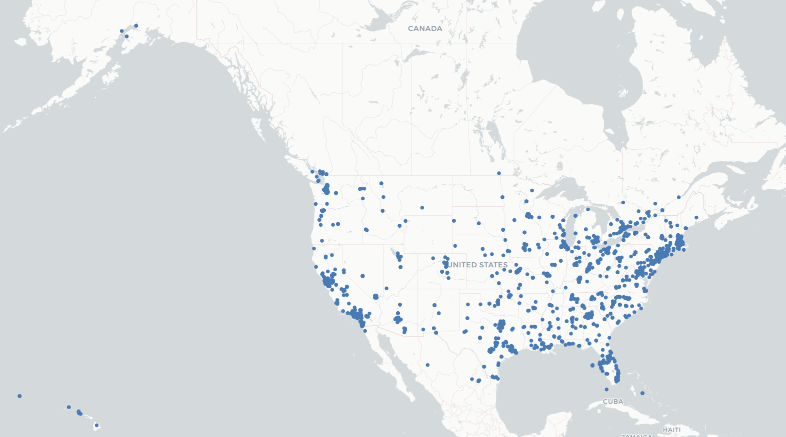
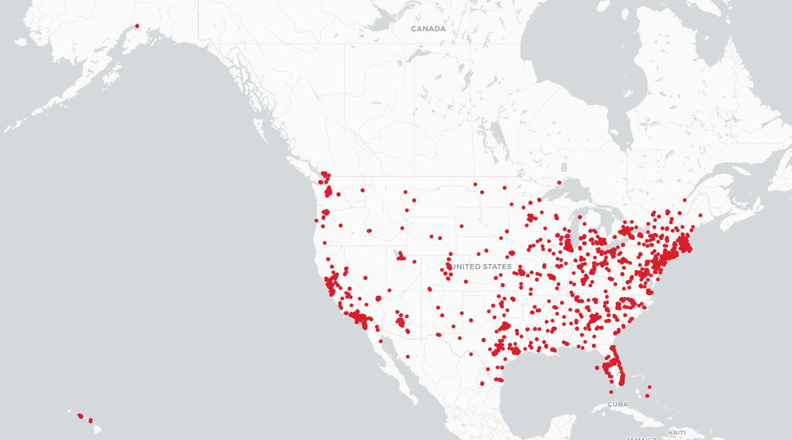
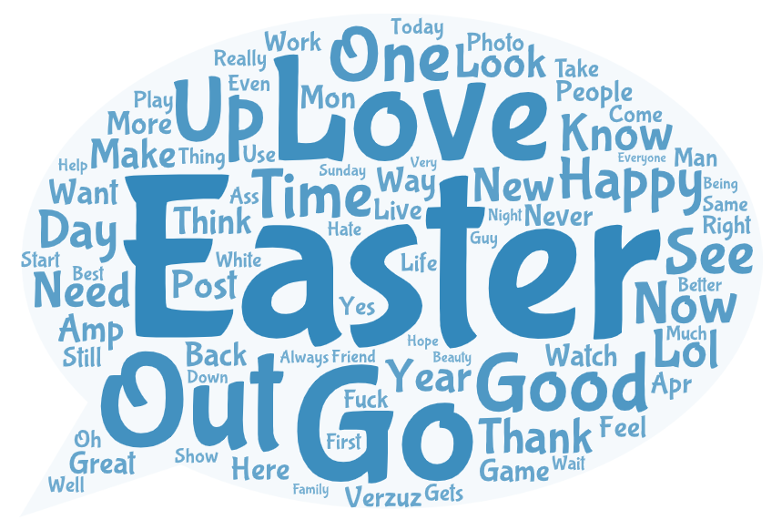
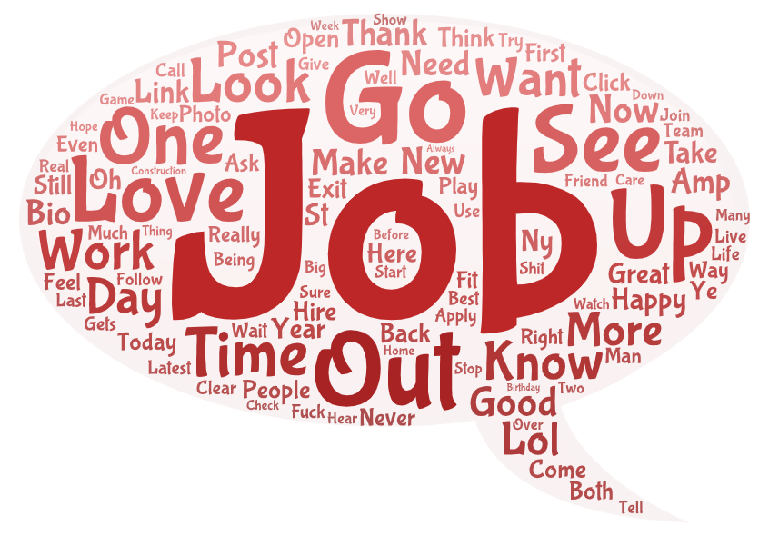

# GEOG458 Lab2: Geo-tagged Tweet Collection and Visualization
## Introduction
I used the crawler to collect tweets in the same geographical areas, and two different times. I collected tweets from the U.S. region on sunday night, April 17th, and on Wednesday, April 20th. I wanted to compare these two different times beacuse April 17th was the Easter day, so I was interested in if there is a different behavior and pattern of using Twitter on holidays compared to normal work days. I used the crawler to collect tweets in the U.S. region on the Easter day in the evening, and collect the tweets on work day in the afternoon. The crawler worked for 10 minutes in both situations. 

## Comparison of Two Maps
### Geospatial Pattern of Tweets on the Easter Day (April 17th)

### Geospatial Pattern of Tweets on Work Day (April 20th)

The two maps present a similar pattern of using Twitter that most of the tweets are collected around urban areas. We can see that most dots on the maps are gathered around Seattle, costal areas in California and Florida, and also a huge cluster around NYC. In contrast, there are less tweets collected from the rural areas such as central U.S. Furthermore, there is one difference I noticed in these two maps. The dots in the second map is denser than the first map which indicates that there were more tweets collected, or there were more people using Twitter on Wednesday than on Sunday. I think it is because sunday was the Easter day. Therefore, in the evening, many people chose to celebrate the Easter day with their family such as having family meals, decorating Easter eggs, and so on. So, people spent less time on Twitter. In contrast, during work days, Twitter is one way to have a rest in between heavy works or lectures. This may explain why there were more tweets collected on work days than holidays. 

## Comparison of Two Wordclouds
### Wordclouds of Tweets Collected on April 17th

### Wordclouds of Tweets Collected on April 20th

In the first word cloud, high frequency terms among all tweets are Easter, Love, Out, Go and etc. In the second word cloud, high frequency terms are Job, Go, Out, Up, Love, and etc. Some high frequency terms such as Out, Go, Up, and Good are words very commonly used in Twitter and in everyday life. The main difference is that Easter was the most frequently used word on Sunday, and Job was the most frequently used word on Wednesday. I think this is pretty intuitive that Sunday was the Easter day, so people mentioned 'Easter' a lot to celebrate the Easter day. Wednesday was a work day, so people used the word 'Job' a lot. 
